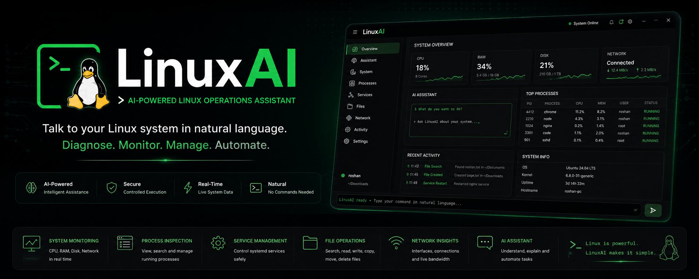
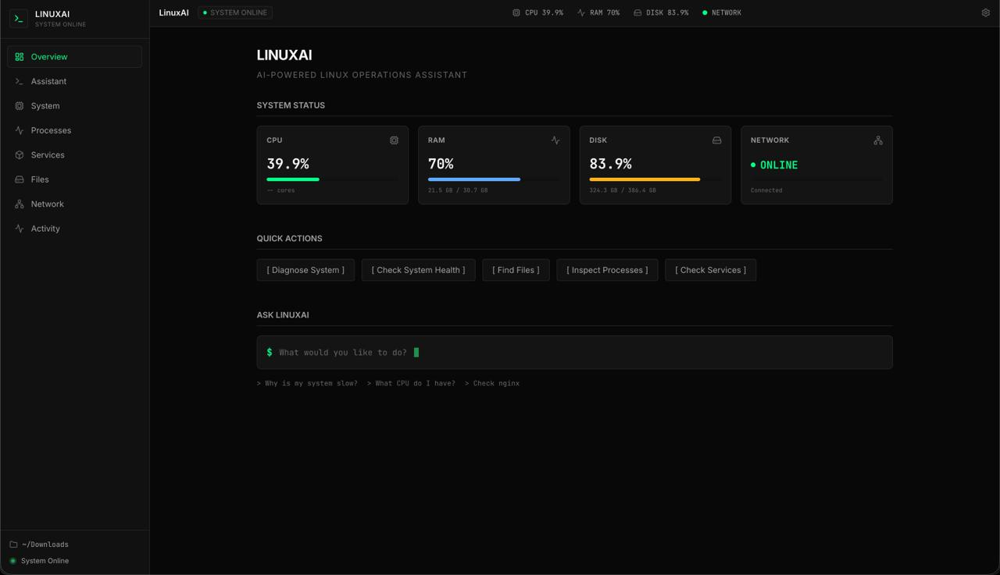
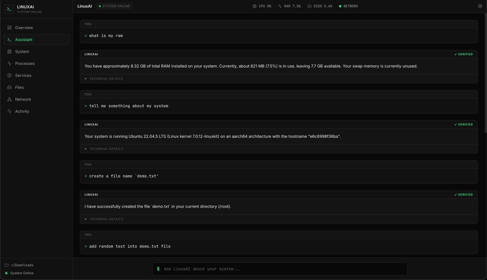
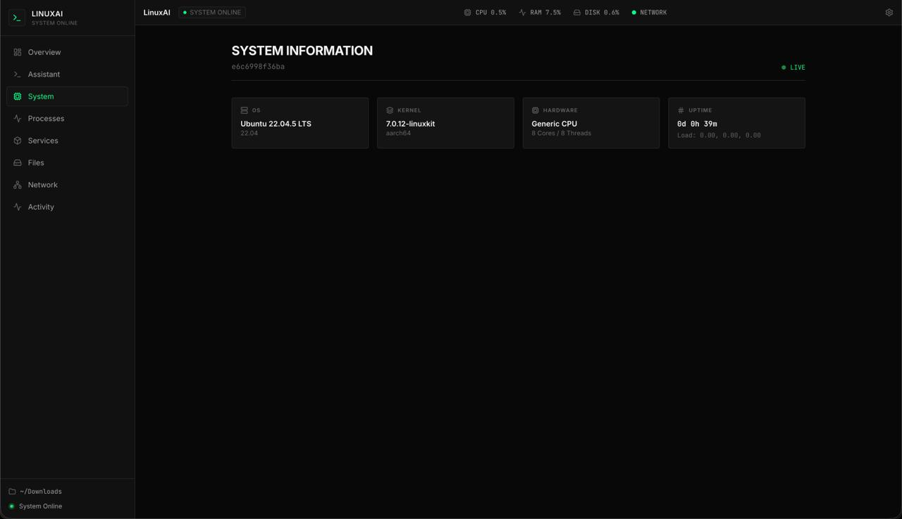
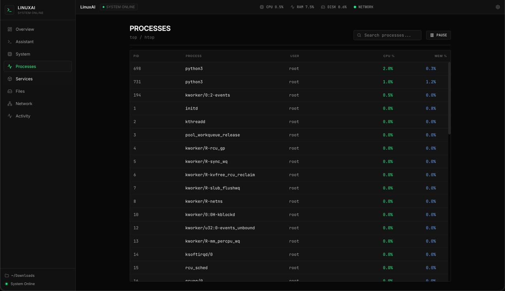
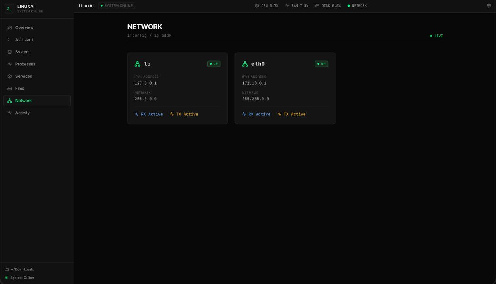
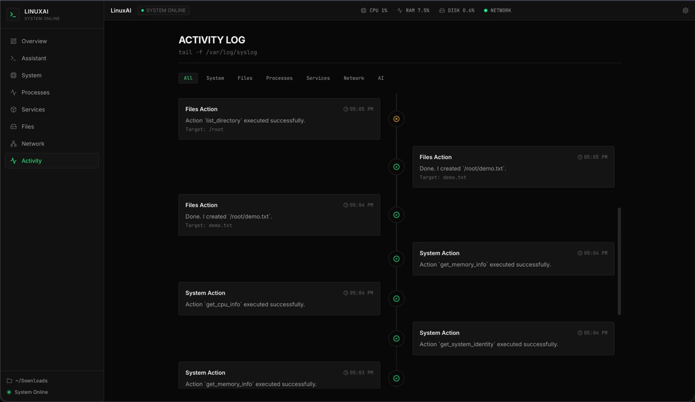
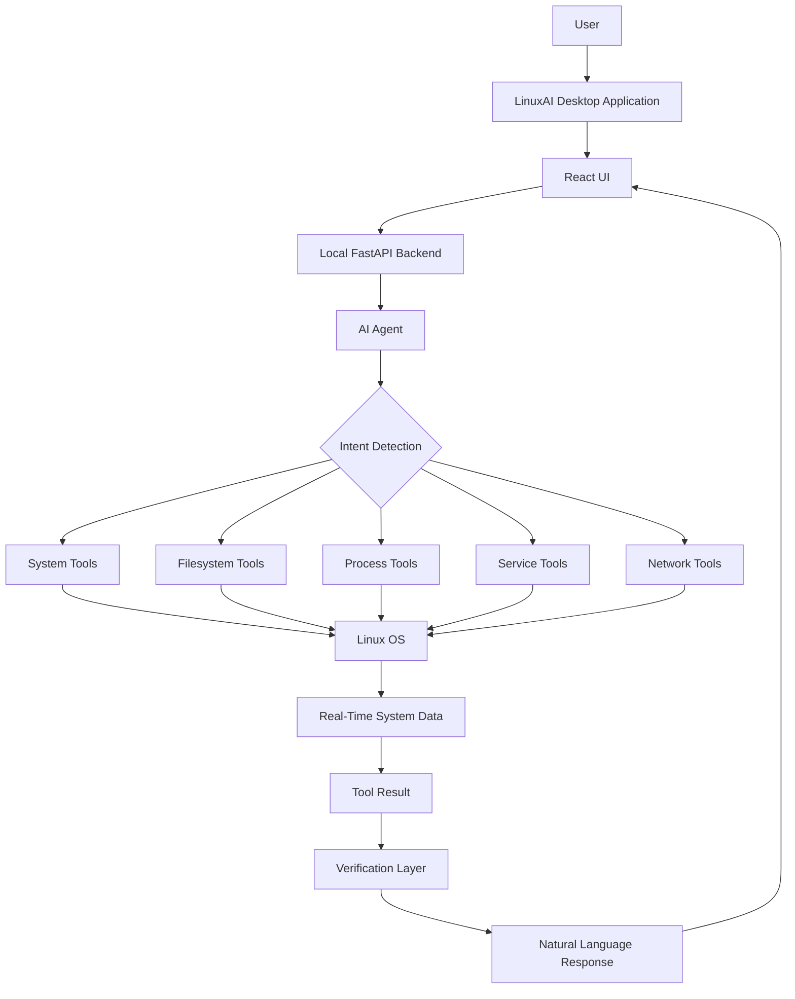
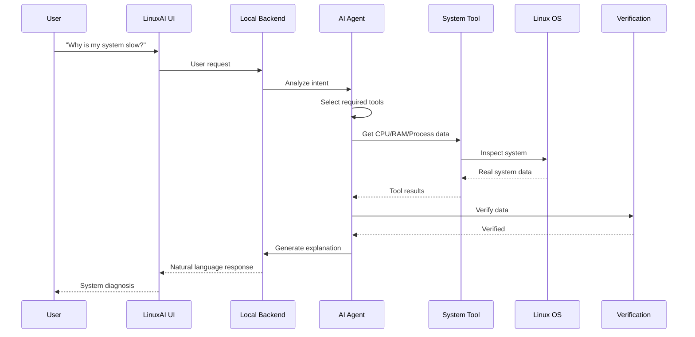
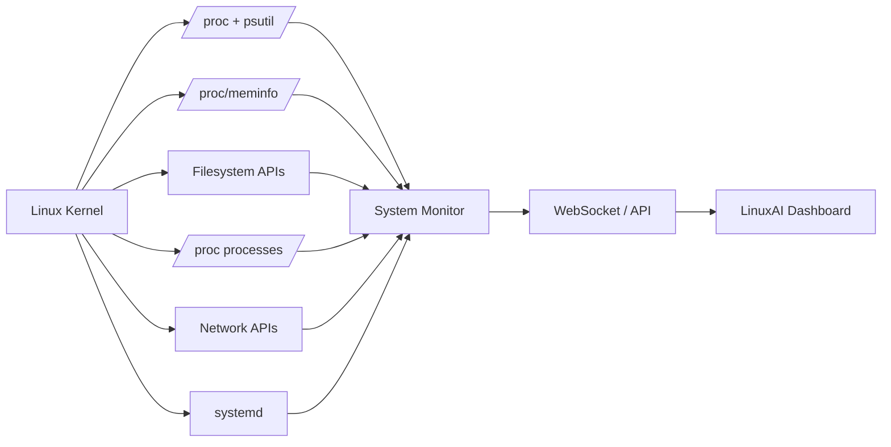

# SSM Hackathon 

Project Title: **LinuxAI Operations Assistant**

## Contributors
Team Name: Tech nuggets<br>
| Member   | Responsibility                              |
| -------- | ------------------------------------------- |
| Roshan Patel | AI Agent + LLM + Tool Calling               |
| Safwan Shaik | Linux System Integration                    |
| Nitheesh S | React/Electron UI + Dashboard               |
| Sreekuttan S | Filesystem + Processes + Services + Testing |
| Vipul Raj Shah | Backend + Security + APIs + ML Engineer  |                  |

<a href="https://github.com/MediaTrex/SSM-Hackathon/graphs/contributors">
  
</a>

## Problem Statement

<b>Integration of AI capabilities in the OS ecosystem(Linux Based) Submission Page</b>

AI-Powered Linux Operations Assistant Using Natural Language Queries
Develop an AI assistant that allows users to interact with Linux using natural language instead of complex commands. It should diagnose system issues, search files and documents, and provide easy-to-understand solutions and recommended Linux commands.

## Proposed Solution 

Our solution is an **AI-powered Linux Operations Assistant** that acts as an intelligent natural-language layer between the user and the Linux operating system. Users can simply ask questions such as *“Why is my system slow?”, “Find large files,” or “Why isn’t my web server running?”* and the AI will understand the intent, inspect system resources, processes, files, services, logs, and network status, diagnose the underlying problem, recommend the appropriate Linux commands or actions, and—after permission—safely execute and verify them. Unlike a basic AI command generator, our system combines **AI reasoning, direct Linux OS integration, intelligent file/document search, autonomous troubleshooting, explainable recommendations, and a safety-controlled execution layer**, making Linux more accessible, intelligent, and user-friendly.

## TO QUICK START 

Setup **.env** file in the root directory
```
GEMINI_API_KEY=
```
If you using Window then kindly run the Docker. </br>
For backend, we use **Ubuntu Container** as **linux**
```
docker-compose up --build
```

For the frontend , in new terminal
```
cd frontend
npm run dev
```
Now, Visit 
<a>http://localhost:5173</a>

## Live Demo

**Deployed App:** [https://ssm-hackathon-wine.vercel.app/](https://ssm-hackathon-wine.vercel.app/)


## Demo video

[https://youtu.be/gYflrm_R7FE](https://youtu.be/gYflrm_R7FE)


## Project Screenshots

### LinuxAI - Complete UI Overview

<table>
  <tr>
    <td align="center"><br></td>
    <td align="center"><br></td>
    <td align="center"><br></td>
  </tr>
  <tr>
    <td align="center"><br></td>
    <td align="center"><br></td>
    <td align="center"><br>
    <strong><a href="./docs/screenshots">more...</a></strong></td>
  </tr>
</table>


## System Architecture


## AI Request Workflow

## Real Time Monitoring Architecture

